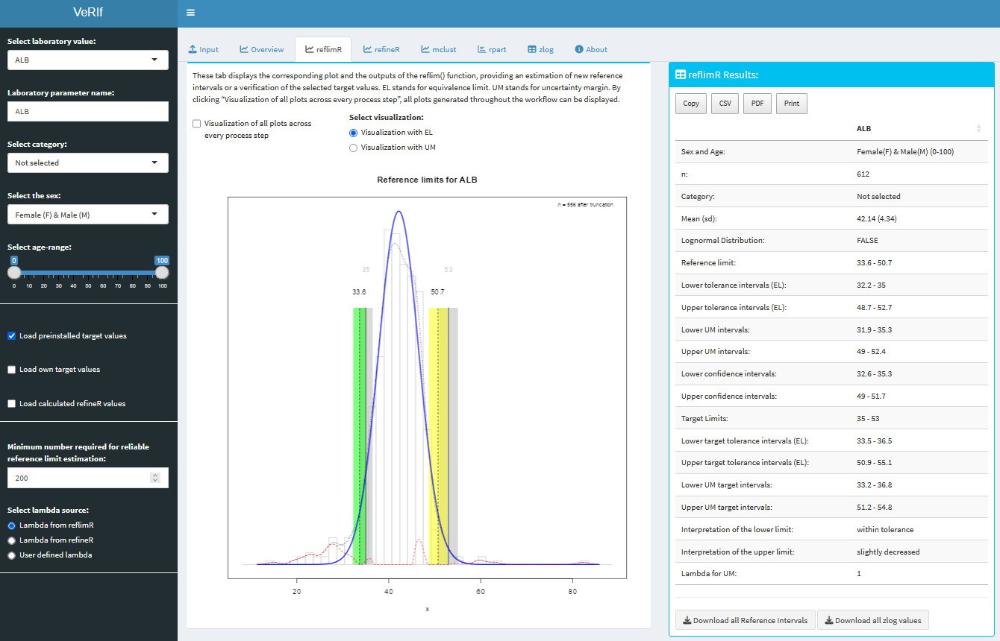

# Shiny App: VeRIf


This Shiny App is for the verification of reference limits from routine laboratory results with reflimR and refineR.

## Installation 

**Method 1:**
Use the function ```runGitHub()``` from the package [shiny](https://cran.r-project.org/web/packages/shiny/index.html):

```bash
if("shiny" %in% rownames(installed.packages())){
  library(shiny)} else{install.packages("shiny")
  library(shiny)}
runGitHub("VeRIf", "SandraKla")
```

**Method 2:**
Download the ZIP file for this Shiny App. Unzip the file and set your working directory to the path of the folder.
The package [shiny](https://cran.r-project.org/web/packages/shiny/index.html) (≥ 1.7.1) must be installed before using the Shiny App:

```bash
# Test if shiny is installed:
if("shiny" %in% rownames(installed.packages())){
  library(shiny)} else{install.packages("shiny")
  library(shiny)}
```
And then start the app with the following code:
```bash
runApp("app.R")
```



The package [reflimR](https://cran.r-project.org/web/packages/reflimR/index.html) (≥ 1.1.0), [refineR](https://cran.r-project.org/web/packages/refineR/index.html) (≥ 2.0.0), [mclust](https://cran.r-project.org/web/packages/mclust/index.html) (≥ 6.1.2), [DT](https://cran.r-project.org/web/packages/DT/index.html) (≥ 0.33), [readxl](https://cran.r-project.org/web/packages/readxl/index.html) (≥ 1.4.5), [rhandsontable](https://cran.r-project.org/web/packages/rhandsontable/index.html) (≥ 0.3.8), [rpart](https://cran.r-project.org/web/packages/rpart/index.html) (≥ 4.1.24), [rpart.plot](https://cran.r-project.org/web/packages/rpart.plot/index.html) (≥ 3.1.4), [shinycssloaders](https://cran.r-project.org/web/packages/shinycssloaders/index.html) (≥ 1.1.0) and [shinydashboard](https://cran.r-project.org/web/packages/shinydashboard/index.html) (≥ 0.7.2) are downloaded or imported when starting this app. The used [R](https://www.r-project.org) version must be ≥ 4.5.2.

## Preloaded dataset
Data from the [UC Irvine Machine Learning Repository](https://archive.ics.uci.edu/ml/datasets/HCV+data) showing *livertests* has been preloaded into this Shiny App. In addition, the corresponding reference intervals are stored in *targetvalues*. The reference interval table has been derived from the data published in the [Clinical Laboratory Diagnostics](https://www.clinical-laboratory-diagnostics.com) by Lothar Thomas, MD.

## New data
These columns should be used for new data:

* **Category**:   Grouping variable used to filter the data, for example cohort, method, instrument or sample group. Use the same category name for rows that should be analyzed together; if no grouping is needed, use one constant category for all rows.
* **Age**:        Age in years
* **Sex**:        For example "m" for male and "f" for female
* **Value**:      Column name is the analyte name, values are the laboratory measures

Starting with the fourth column, enter the laboratory value; the other three columns can be in any order. The data from *livertests* serves as a [template](https://github.com/SandraKla/VeRIf/tree/main/www/template.csv). To load new data, the data should be in CSV format with values separated by semicolons (;), and decimal numbers should use a comma (,) as the decimal separator. The first row should contain column headers.
Alternatively, the data can be loaded into the editable table using the copy-and-paste function or with XLSX (see [template](https://github.com/SandraKla/VeRIf/blob/main/www/template.xlsx)).

## Usage

The left sidebar controls the laboratory parameter, category, sex and age range used throughout the analysis. It also allows you to use the preinstalled target values, enter custom target values, or reuse the reference interval estimated in the *refineR* tab.

The tabs provide the following functions:

* **Input**: Upload a CSV or XLSX dataset, map the age and sex columns and the female/male values, or paste data into the editable table.
* **Overview**: Inspect the relationship between age, sex and the selected laboratory parameter.
* **reflimR**: Estimate a reference interval or verify selected target values with the `reflim()` function. The plot can display equivalence limits (EL) or uncertainty margins (UM).
* **refineR**: Perform a follow-up indirect reference interval estimation. The resulting limits can be selected in the sidebar and re-verified with *reflimR*.
* **mclust**: Examine the data with a Gaussian mixture model. The number of clusters can be selected automatically or entered manually.
* **rpart**: Explore additional stratification by age and sex using a regression tree.
* **zlog**: Display the dataset together with its calculated reference interval and a zlog value for every result.

If a yellow or red bar appears while verifying target values with *reflimR*, a follow-up analysis with *refineR* is recommended. If the newly estimated limits produce green indicators when re-verified, this suggests that the original target values may be unsuitable. If one or more indicators remain yellow or red, the data may be too challenging for indirect methods; the *mclust* tab can help investigate this further.

The results panel contains the detailed *reflimR* and *refineR* output. Tables can be copied, exported as CSV or PDF, or printed. **Download all Reference Intervals** creates a ZIP archive with results for all laboratory parameters, while **Download all zlog values** exports the corresponding values as CSV.

## Contact

You are welcome to:
- Submit suggestions and bugs at: https://github.com/SandraKla/VeRIf/issues
- Make a pull request on: https://github.com/SandraKla/VeRIf/pulls
- Write an email with any questions and problems to: s.klawitter@ostfalia.de

## Disclaimer

Only anonymized data may be uploaded to this application. This application is provided “as is” and “as available”, without any express or implied warranties of any kind. No warranty is given regarding the accuracy, completeness, reliability, or timeliness of the results. The results are provided for informational and research purposes only and must not be used for diagnosis, treatment, prevention, or any form of clinical or medical decision-making. This application is not a medical device or medical product and does not replace professional medical advice. To the fullest extent permitted by law, the author disclaims all liability for any direct, indirect, incidental, consequential, or special damages arising from the use of this application or its results. Use of this application is entirely at your own risk.
